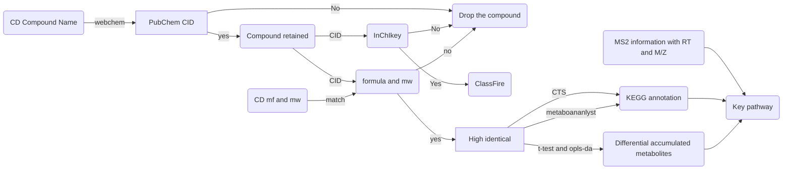

# Data analysis for untargeted metabolomics.
  

  

Wrok flow for untargeted metabolomics analysis 

**Workflow:** 

The candidate metabolites were identified by [Compound Discoverer](https://www.thermofisher.cn/cn/zh/home/industrial/mass-spectrometry/liquid-chromatography-mass-spectrometry-lc-ms/lc-ms-software/multi-omics-data-analysis/compound-discoverer-software.html) , and the raw compound qualification data was generated which contains about 9000 compounds. Most of these metabolites are unreliable. But if we use more strict filter condition, only small number of candidates left (less than 1000), It is hard to reflect the biological issue which biologist concerned. This is a big problem for large scale untargeted metabolomics.
In order to solve this problem, we used a strategy that using a flexible condition to allow the existence of false positive compounds to help us digging out the key metabolic pathways between mutant and wildtype. Once the key pathway were found, a strict condition will be used (MS2 information or targeted metabolite estimate) to confirm the discovery.  

## Step1. Remove false positive errors by Pubchem database.  

The compound name was set as the query data to get pubchem cid by[Webchem](https://github.com/ropensci/webchem). Drop the false matched compounds.  

`Molecular Formula`,	`Molecular Weight`,	`InChIKey`,	`IUPACName` and	`ExactMass` of correspond compound was obtained by `webchem`. Compounds which have same molecular formula and bias of molecular weight smaller than 5 were labeled as high identical compounds.  

## Step2. Compounds classification.  

High identical compounds were classfied by [ClassFireR](https://github.com/aberHRML/classyfireR) via `InChIKey` of each compound.  

## Step3. Pairwised differential accumulated metablites analysis

Welch *t*-test (two-side) were used for estimate the accumulation bias of comparison group. The multiple comparison test （BH method）was done to correct the p-value. and OPLS-DA ([ropls](https://github.com/SamGG/ropls)) was done to reduce within-group difference, and VIP value was generated.

The DAM cut-off : `p-value <= 0.05 & VIP > 1`

## Step4. Pathway analysis

The KEGG annotation were obtained from [CTS](http://cts.fiehnlab.ucdavis.edu/batch) and [metaboananlyst](https://dev.metaboanalyst.ca/MetaboAnalyst/upload/PathUploadView.xhtml).  

For CTS, `InChIKey` was used as input data.  
For metaboananlyst, `CD Compound Name` was used as input data.

## Step5. Compounds in focused pathway validation.

The **rough candidate compounds** in focused pathway were select out from DAM datasets， after screening the inhouse script constructed `Arabidopsis thaliana KEGG compound database`, compounds which belongs to *Arabidopsis thaliana* （according to kegg database）were selec out. The **fine candidate compounds** were double check by Compound discovery software with the MS2 database (mzcloud and mzvalut). Finally High confidencial compounds were ensured. Furthermore, key compounds were evaluated by targeted metabolomic method. The results are highly consistent with our untargeted metabolomic result. It is also proved the accuracy of our untargetd metabolomic workflow.

